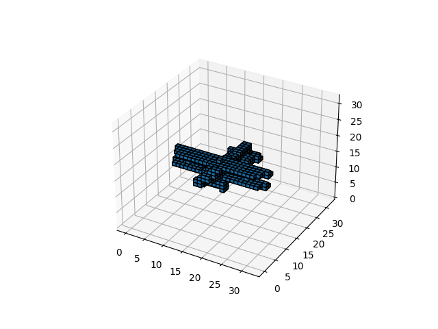
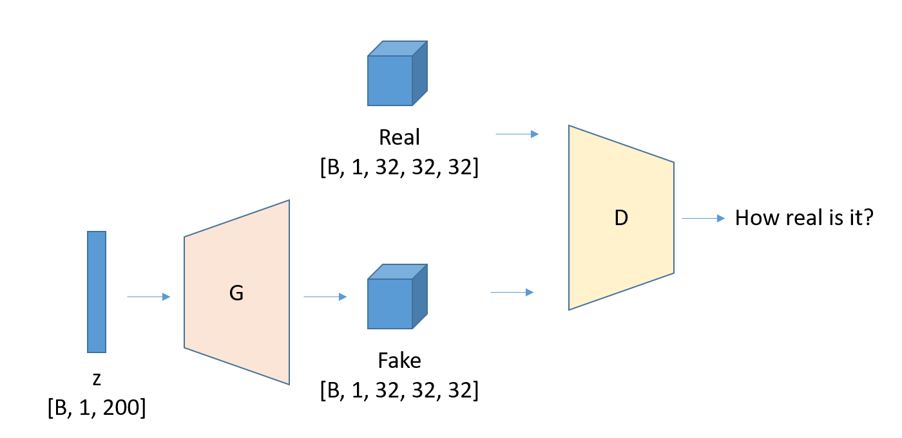
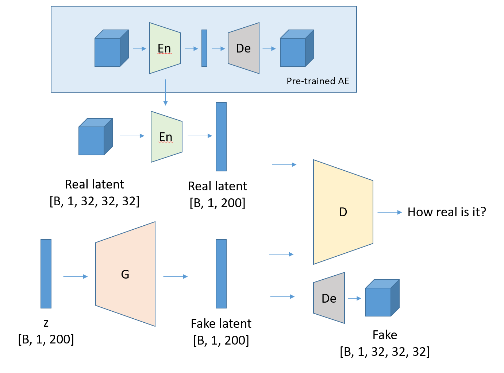
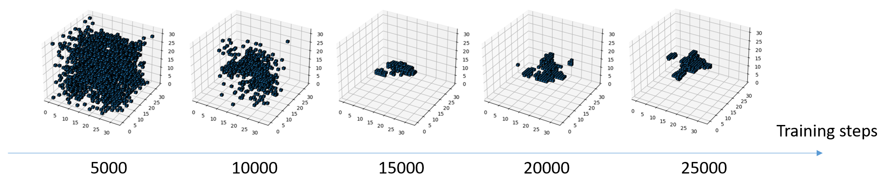
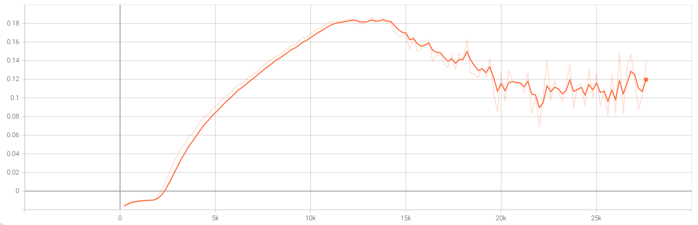
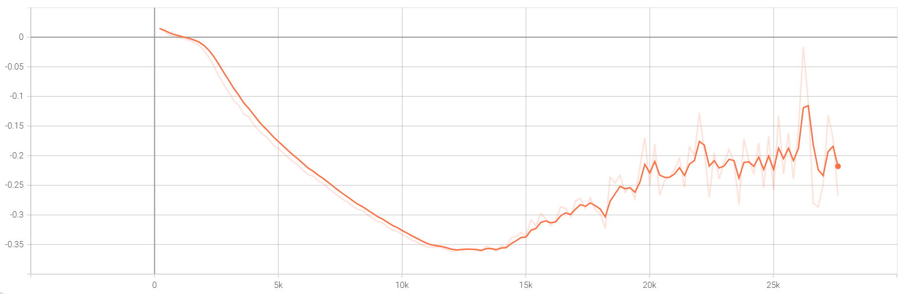
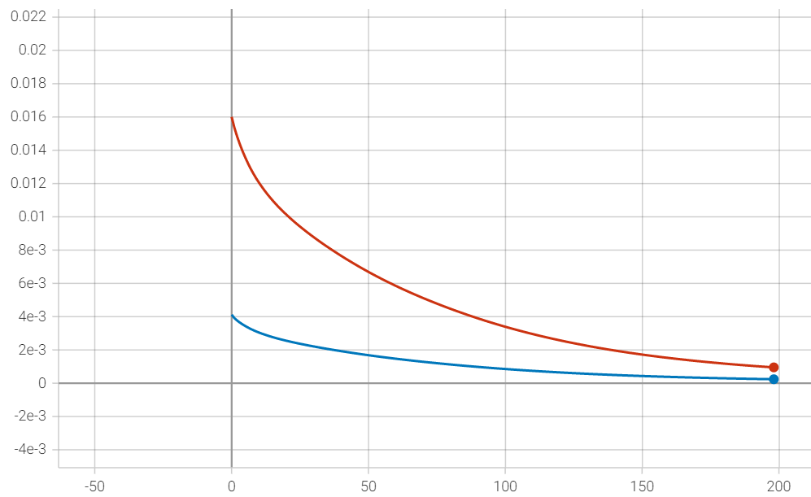

# Generating-3D-Shapes

## Overview
This project follows ["Learning a Probabilistic Latent Space of Object Shapes via 3D Generative-Adversarial Modeling"](http://3dgan.csail.mit.edu/) to generate 3D shapes with a few modifications.

Specifically, the task tries to generate certain 3D shapes from a vector following some pre-defined distribution. Here, the training data is from [ModelNet dataset](https://3dshapenets.cs.princeton.edu/), which contains 160 different classes of 3D object. I choose the airplane object, which have 8712 training data, each has the size of [30, 30, 30].

The input I choose here is a randomly generated vector following Gaussian distribution. To stabilize training, I used 
[Wasserstein GAN](https://arxiv.org/abs/1701.07875). The generator of W-GAN can be designed in two ways, the first is to directly generate a 3D shape, then use discriminator to tell the difference between the fake 3D shape and real 3D shape; the second is to generate a latent feature, for example, a z-dimension vector, and use the discriminator to tell the difference between the fake latent feature and the true latent feature which can be obtained by using Auto-encoder.

Direct-GAN:

Latent-GAN:

## Result
For directly generating 3D shapes, I trained 8 hours on RTX-3070-Laptop, the result is as follows

The Generator is not so good as the Discriminator at the beginning of training, but becomes better afterwards. Its loss is

The Discriminator loss is

For generating latent feature, I first trained the AE network 3 hours on RTX-3070-Laptop. I divided the dataset into a training-set and a test-set in the ratio of 8:2, the loss function is as follows, where the red line is the test loss, and the blue line is the training loss.

## Run

### Prepare Data
First download the dataset from [link](https://3dshapenets.cs.princeton.edu/), then move the `volumetric_data` under this project, and run `mat2np.py`, this will convert the `.mat` file to numpy array and generate a directory named `airplaneData` to store them.

### Train direct GAN
Run `directGAN.py`, this will generate three directories named `output`, `checkpoint`, `tensorboard_save` to save fake 3D shapes, model parameters, and loss value, respectively.

Run `show3D.py` to visualize some generated shapes.

Run `tensorboard --logdir=tensorboard_save` to see the training loss.

### Train latent GAN
Run `trainae.py` to train the encoder and decoder networks.

Run `tensorboard --logdir=tensorboard_aesave` to see the training loss.

